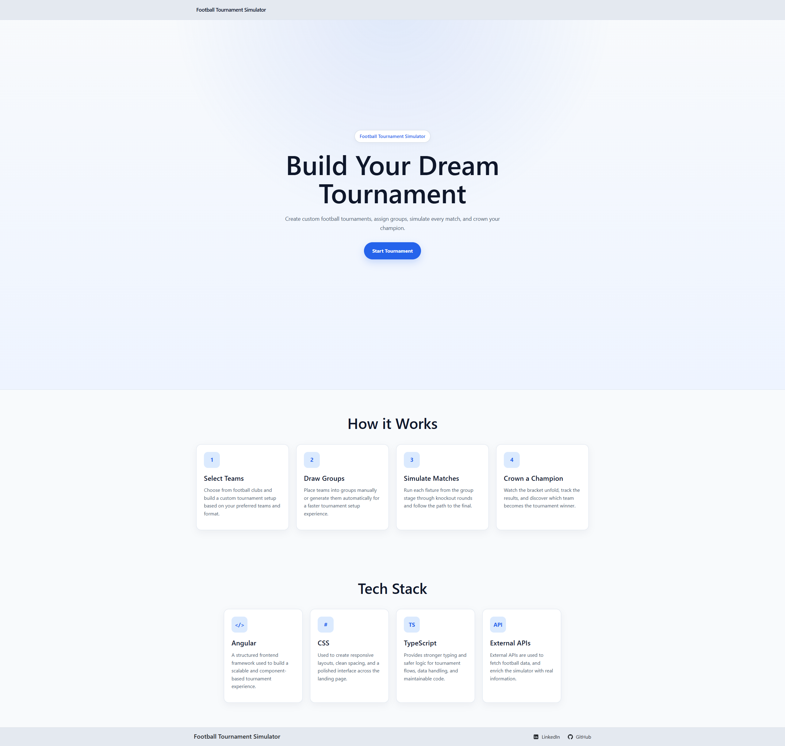
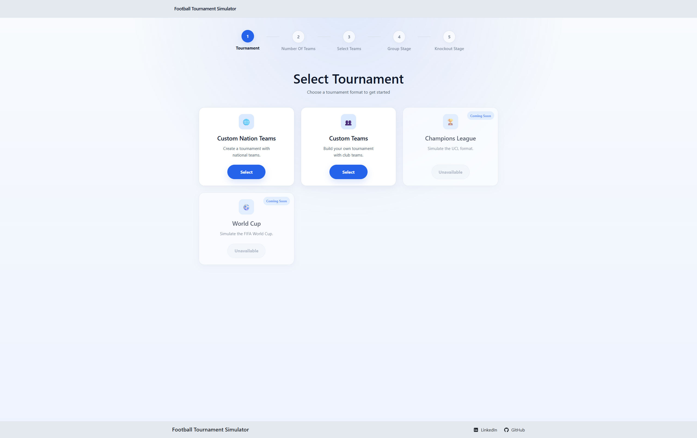
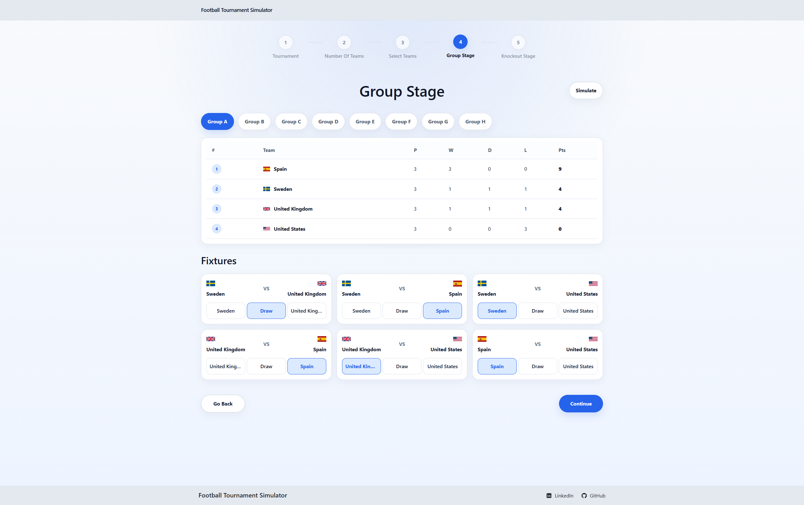
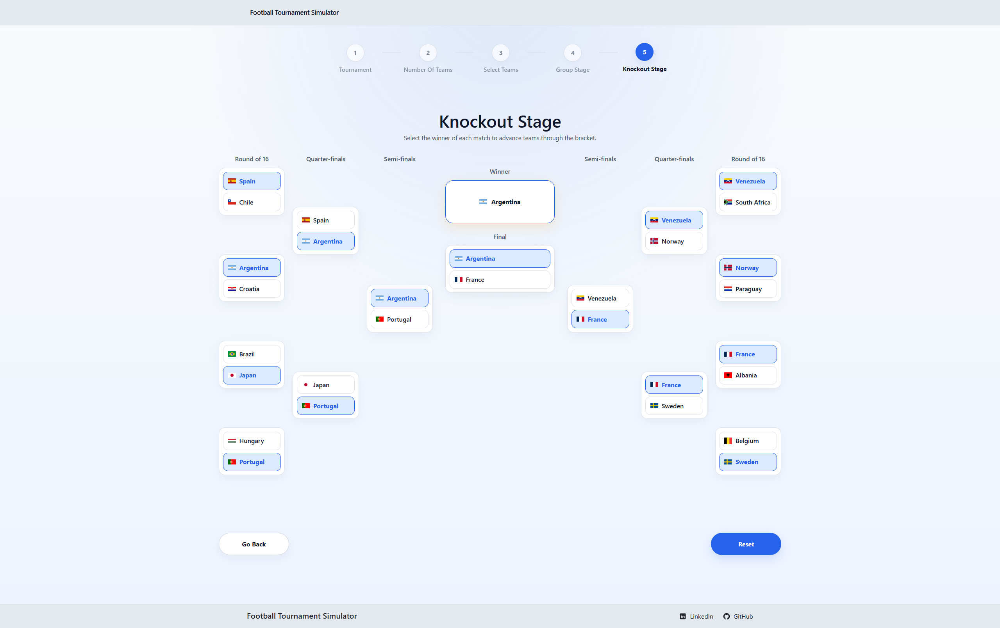

# Football Tournament Simulator

A frontend project built with Angular where users can create and simulate a football tournament through a guided step-by-step flow.

## Live Demo

[Open the deployed site](https://charbel03.github.io/FootballTournamentSimulator/)

## About the Project

Football Tournament Simulator is a single-page Angular application where the user can set up a tournament, choose the number of teams, assign teams into groups, and continue through the tournament flow from group stage to knockout stage.

The project focuses on a clean user flow and reusable Angular components.

## Features

- Landing page with project presentation
- Tournament setup flow
- Select tournament type
- Choose number of teams:
  - 8 teams
  - 16 teams
  - 32 teams
  - 48 teams
- Select and place teams into groups manually
- Auto draw teams into groups
- Group stage view
- Knockout stage bracket view
- Responsive UI
- Deployed with GitHub Pages

## Current Status

At the moment, the fully active setup path is:

- **Custom Nation Teams**
- **Custom Teams**

The following tournament options are visible in the UI but are not yet fully available:

- Champions League
- World Cup

## Tech Stack

- **Angular 21**
- **TypeScript**
- **HTML**
- **CSS**
- **Angular Router**
- **RxJS**
- **Vitest**
- **GitHub Pages**
- **GitHub Actions**

## Screenshots

### Landing Page

### Tournament Setup

### Group Stage

### Knockout Stage

